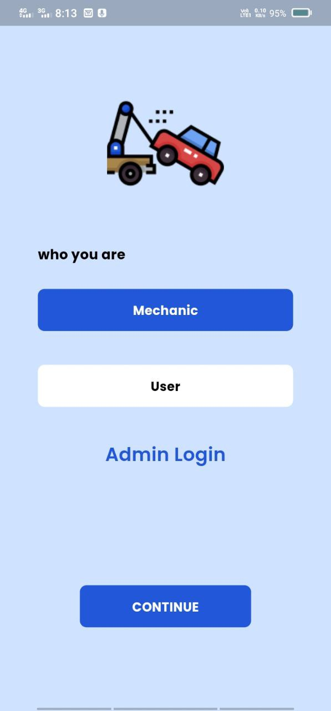
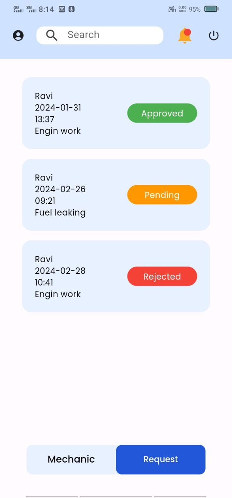
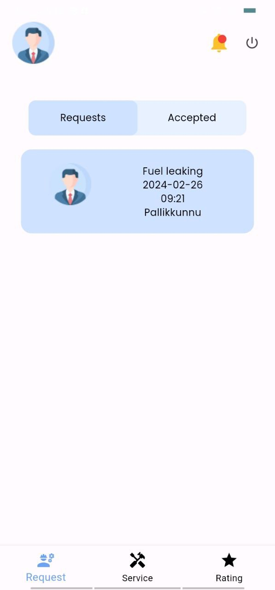
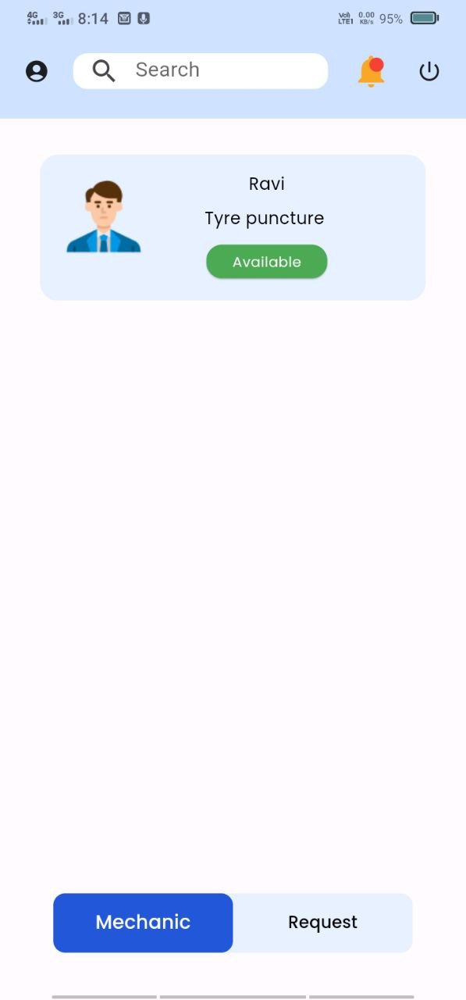

## Remote Vehicle Breakdown Assistance (RVBA)

**Final Year Degree Project**

This repository holds the code for my final degree project, RVBA - a mobile application-based Remote Vehicle Breakdown Assistance system. Developed as a team project intern at Softroniix with the help and guidance of mentors, RVBA aims to revolutionize roadside assistance, particularly in remote locations. Completely made with flutter and backend integrated with firebase, FIrestore is used for database

**Abstract**

RVBA tackles the ever-present challenge of vehicle breakdowns by offering real-time support and efficient service to stranded drivers. Key features include:

-   Location-based service for faster assistance.
-   Mechanic selection based on experience and ratings.
-   Real-time vehicle health and location monitoring.
-   User-friendly mobile app for requesting assistance, sharing details, and tracking service status.
-   Two-way communication with mechanics.
-   Mechanic rating system for continuous improvement.
-   Simultaneous notifications for streamlined communication.
Here's my results: 

    
    &nbsp; &nbsp; &nbsp; &nbsp; &nbsp;
    
    &nbsp; &nbsp; &nbsp; &nbsp; &nbsp;
    
     &nbsp; &nbsp; &nbsp; &nbsp; &nbsp;
     

